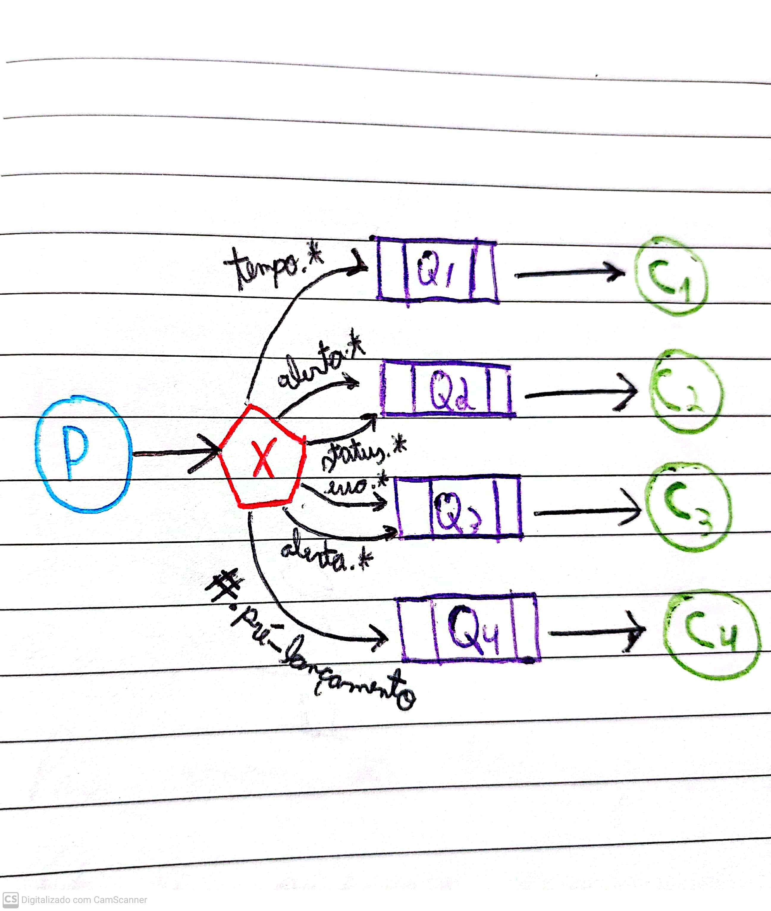
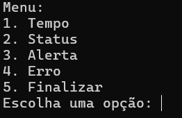
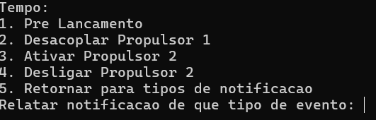
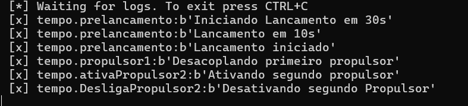
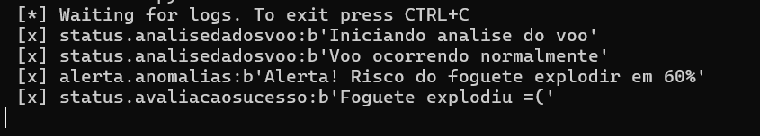
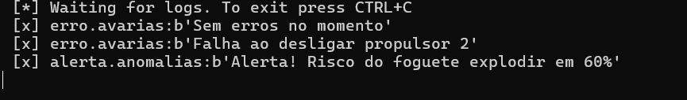
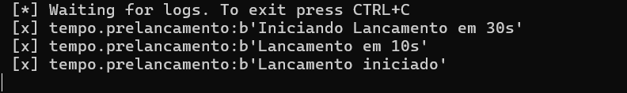

# Arquitetura-orientado-eventos
Desenvolvido por: **Rosemar Vieira** e **Leonardo Cardozo**

Aqui está uma simples aplicação  orientada em **microsserviços**. Os códigos for feitos em Python e são baseados nos tutoriais disponibilizados no [RabbitMQ](https://www.rabbitmq.com/tutorials/tutorial-one-python.html).

Para que sse projeto fosse possível, foi preciso utilizar o serviço de mensagem _Message Broker_ do RabbitMQ e o protocolo **AMQP** (_Advanced Messafe Queuing Protocol_) para assim, permitir a comunicação indireta entre os processos clientes.

## Estrutura
Essa aplicação simula um lançamento de foguete. Essa ideia surgiu a partir de uma notícia recente (Março de 2024) sobre um lançamento feito pela _SpaceX_.

A imagem a seguir apresenta o planejamento de como seria nosso trabalho.

Uma mensagem é enviada como um **tópico**, assim, as *routing_keys* seguem um padrão como "`tempo.preLancamento`" O padrão utilizado aqui foram duas palavras.

## Comandos
Nessa aplicação, esses são os comandos que serão utilizados:
* tempo.prelancamento;
* tempo.propulsor1;
* tempo.ativaPropulsor2;
* tempo.desligaPropulsor2;
* status.analisedadosvoo;
* status.avaliacaosucesso;
* alerta.anomalias;
* erro.avarias.

## Produtor
O **produtor** é responsável por emitir cada um desses comandos. Para isso, o código `p1_AppCentral.py` é responsável por emitir sinais para as centrais de comando (**Consumidores**).

Esse código permite que o usuário, se utilizando do terminal possa escolher qual mensagem queira enviar.

 

## Consumidor 1
O primeiro consumidor recebe todas as mensagens relacionadas ao tempo, seja o pré-lançamento, ou o tempo em que um propulsor foi ativado ou desativado. Seu código é `c1_MonitorTempo.py`.

## Consumidor 2
Esse consumidor recebe mensagens de Status, sempre buscando saber da situação do foguete. Por esse motivo, é necessário que ele também receba alertas caso ocorra. Seu código é `c2_MonitorAlertaStatus.py`.

## Consumidor 3
Esse consumidor recebe todas as informações relacionada a problemas, por isso, ela deve saber quando ocorrer algum erro principalmente se a situação estiver em alerta. Seu código é `c3_MonitorAlertaErro.py`.

## Consumidor 4
O último consumidor é um gerenciador do pré-lançamento, portanto, não precisa receber todas as mensagens sobre o tempo. Seu código é `c4_MonitorPreLauch.py`.

Após vários testes, o programa mostro ser eficiente.
